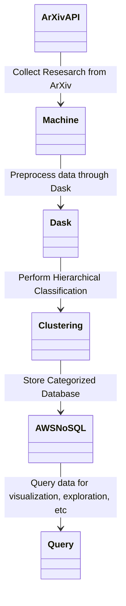

# Eco-Sourced
A database, visualization, and overview of environmental research topics through available sources

Relevent Papers:
- Literature Clustering Algorithm: https://www.ncbi.nlm.nih.gov/pmc/articles/PMC9420566/
- Hierarchical classification of Web content: https://dl.acm.org/doi/abs/10.1145/345508.345593
- Hierarchical Classification across multiple domains: https://link.springer.com/article/10.1007/s10618-010-0175-9
- Semantic Hierarchy in DOT: https://arxiv.org/pdf/2105.00101.pdf

Relevent Sources:
- ArXiv bulk research papers from Amazon S3

