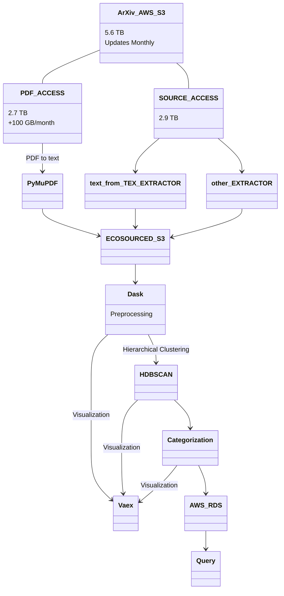

# Eco-Sourced
A database, visualization, and overview of environmental research topics through available sources

## What is this?
The goal for this project is to aggregate a large amount of Environmental research papers, and organize them for simplicity at understanding the domain of Environmental Sciences.  This will aid in answering questions such as:
- What Environmental Science fields are being studied?
- What Environmental Science research has already been done?
- What Environmental Science topics can I contribute to?
- What Environmental Science topics need to be worked on?
- What are the most densely worked on topics?

#### Relevent Papers:
- Literature Clustering Algorithm: https://www.ncbi.nlm.nih.gov/pmc/articles/PMC9420566/
- Hierarchical classification of Web content: https://dl.acm.org/doi/abs/10.1145/345508.345593
- Hierarchical Classification across multiple domains: https://link.springer.com/article/10.1007/s10618-010-0175-9
- Semantic Hierarchy in DOT: https://arxiv.org/pdf/2105.00101.pdf
- Research Taxonomy: https://brieflands.com/articles/apid-112456.html

#### Relevent Sources:
- ArXiv bulk research papers from Amazon S3: https://info.arxiv.org/help/bulk_data_s3.html

### Technical Flowchart

Contributions are very welcomed! Please submit a pull request, or feel free to reach out at branisk@protonmail.com.
